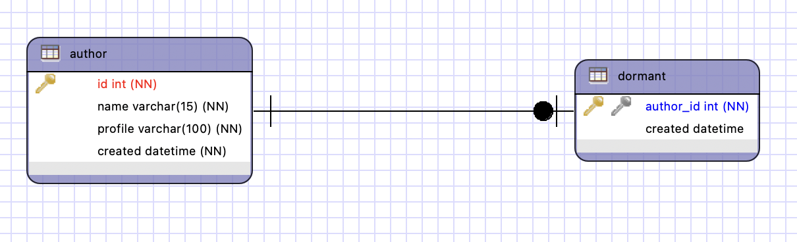
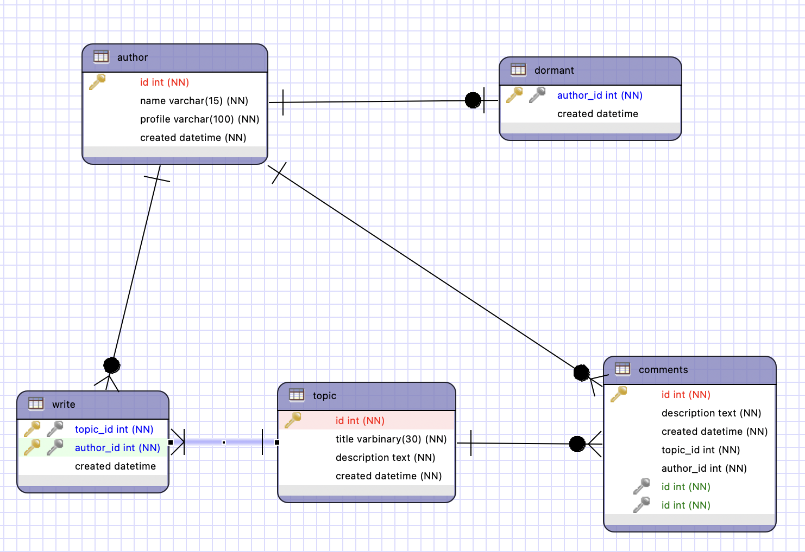
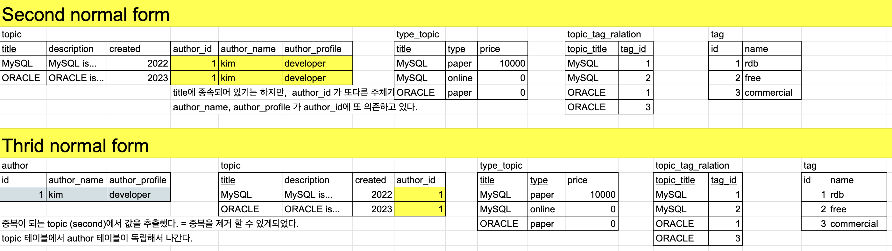

## ERD 계획 단계

- 업무파악<br>
- 개념적 데이터 모델링<br>
- 논리적 데이터 모델링<br>
- 물리적 데이터 모델링<br>

### 230812

### Eclipse - ERMster - mysql

---

[ 이클립스 ERMaster 플러그인 사용하기 ]

- 테이블 컬럼 생성하기.<br>

  1. .erm 설정하기<br>
     제약조건 설정하기 = 컬럼에대한 "도메인"을 설정한다. 즉, 어떤 데이터타입 범위를 사용하겠다는 경계를 지어준다.
  2. 테이블 생성하기<br>
     1)author : id int (NN), name vc(15)(NN), profile vc(100)(NN), created datetime(NN)<br>
     2)topic : id int (NN), title vc(30)(NN), description test (NN), created datetime(NN)<br>
     3)comments: id int (NN),description test (NN), created datetime(NN)<br>
     4)dormant : author_id (NN), created datetime(NN)<br>
     - 휴면자 ( 1:1 데이터 관계의 처리를 위해서 테이블을 추가 생성함 ) <br>
     - author_id 와 동일하게 id값 생성

---

## 관계의 처리 방법

### Relationship -> PK, FK

1. 1 : N 관계<br>
2. 1 : 1 관계<br>
   

- dormant는 author에게 의존하고있다.<br>
  혼자서도 잘 지낼 수있는 테이블 : 부모테이블 <br>
  의존하는 테이블 : 자식테이블<br>
  그런 맥락에서, 저자테이블의 PK / 휴면테이블 FK 를 설정하자.<br>

3. N : M 관계<br>
   Mapping table

---



### 230813

## First Normal Form 제 1 정규화

## Automatic columns

즉, 각 컬럼의 값들이 원자적이여야한다. = 중복된 값을 제거하고, 각 값을 하나만 가져라

---

## Second Normal Form 제 2 정규화

## No partial dependencies

부분 종속성이 없어야 한다. = 표의 기본키 중에서 중복키가 없어야한다.

---

## Third Normal Form 제 3 정규화

## No transitive dependencies

이행적 종속성<br>
같은 성격의 컬럼을 어떻게 분류할 지 전략을 짜야한다.


---

## denormalization : 역정규화

```
DROP TABLE IF EXISTS `author`;
CREATE TABLE `author` (
  `id` int(11) NOT NULL AUTO_INCREMENT,
  `name` varchar(45) DEFAULT NULL,
  `profile` varchar(100) DEFAULT NULL,
  PRIMARY KEY (`id`)
) ENGINE=InnoDB DEFAULT CHARSET=utf8;

INSERT INTO `author` VALUES (1,'kim','developer'),(2,'lee','DBA');

DROP TABLE IF EXISTS `tag`;
CREATE TABLE `tag` (
  `id` int(11) NOT NULL,
  `name` varchar(45) DEFAULT NULL,
  PRIMARY KEY (`id`)
) ENGINE=InnoDB DEFAULT CHARSET=utf8;

INSERT INTO `tag` VALUES (1,'rdb'),(2,'free'),(3,'commercial');

DROP TABLE IF EXISTS `topic`;
CREATE TABLE `topic` (
  `title` varchar(50) NOT NULL,
  `description` text,
  `created` datetime DEFAULT NULL,
  `author_id` int(11) DEFAULT NULL,
  PRIMARY KEY (`title`)
) ENGINE=InnoDB DEFAULT CHARSET=utf8;

INSERT INTO `topic` VALUES ('MySQL','MySQL is ...','2011-01-01 00:00:00',1),('ORACLE','ORACLE is ...','2012-02-03 00:00:00',1),('SQL Server','SQL Server is ..','2013-01-04 00:00:00',2);
DROP TABLE IF EXISTS `topic_tag_relation`;

CREATE TABLE `topic_tag_relation` (
  `topic_title` varchar(50) NOT NULL,
  `tag_id` int(11) NOT NULL,
  PRIMARY KEY (`topic_title`,`tag_id`)
) ENGINE=InnoDB DEFAULT CHARSET=utf8;

INSERT INTO `topic_tag_relation` VALUES ('MySQL',1),('MySQL',2),('ORACLE',1),('ORACLE',3);

DROP TABLE IF EXISTS `topic_type`;
CREATE TABLE `topic_type` (
  `title` varchar(45) NOT NULL,
  `type` char(6) NOT NULL,
  `price` int(11) DEFAULT NULL,
  PRIMARY KEY (`title`,`type`)
) ENGINE=InnoDB DEFAULT CHARSET=utf8;

INSERT INTO `topic_type` VALUES ('MySQL','online',0),('MySQL','paper',10000),('ORACLE','online',15000);
```

### - 목표 : topic_tag_relation.topic_title 의 값이 MySQL 인 태그의 이름을 알고 싶다.

```
mysql> SELECT tag.name  FROM topic_tag_relation AS TTR LEFT JOIN tag ON TTR.tag_id = tag.id WHERE topic_title="MySQL";
```

| name |
| ---- |
| rdb  |
| free |

---

## 컬럼을 조작해서 JOIN 줄이기

```
ALTER TABLE `topic_tag_relation` ADD COLUMN `tag_name` VARCHAR(45) NULL AFTER `tag_id`;

UPDATE `topic_tag_relation` SET `tag_name` = 'rdb' WHERE (`topic_title` = 'MySQL') and (`tag_id` = '1');
UPDATE `topic_tag_relation` SET `tag_name` = 'free' WHERE (`topic_title` = 'MySQL') and (`tag_id` = '2');
UPDATE `topic_tag_relation` SET `tag_name` = 'rdb' WHERE (`topic_title` = 'ORACLE') and (`tag_id` = '1');
UPDATE `topic_tag_relation` SET `tag_name` = 'commercial' WHERE (`topic_title` = 'ORACLE') and (`tag_id` = '3');
```

### - 목표 : 각각의 저자가 몇개의 글을 작성했는지를 목록으로 표현한다.

```
SELECT
    author_id, COUNT(author_id)
FROM
    topic
GROUP BY author_id;
```

| author_id | COUNT(author_id) |
| --------- | ---------------- |
| 1         | 2                |
| 2         | 1                |
